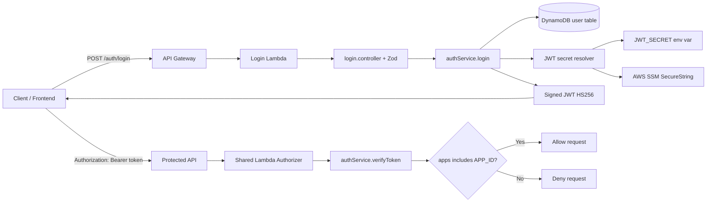

# ARJ Auth Service


Serverless authentication service for ARJ applications.

It provides:

- A `POST /auth/login` endpoint that validates user credentials and returns a JWT.
- A token authorizer Lambda that validates JWTs and checks app access (`apps` claim contains `APP_ID`).
- User storage in DynamoDB (`user` table with `email-index`).

## How It Works

### Architecture diagram



### Request flow

1. Client calls `POST /auth/login` with `email` and `password`.
2. `login` handler uses Middy middlewares (JSON parser, event normalization, CORS, logging, global exception handling).
3. `login.controller` validates payload with Zod.
4. `authService.login()`:
   - Loads user by e-mail from DynamoDB.
   - Compares password using `bcryptjs`.
   - Loads JWT secret (first `JWT_SECRET`, then SSM parameter from `JWT_SECRET_PARAMETER_NAME`).
   - Signs token with `HS256` and returns `{ token, user }`.
5. Downstream APIs can use the shared authorizer Lambda to validate the token and enforce app-level access.

### Main components

- `src/handlers/login/index.ts`: API login Lambda entrypoint.
- `src/controllers/login.controller.ts`: route and request validation.
- `src/services/auth.service.ts`: login and token verification logic.
- `src/services/jwtSecret.ts`: JWT secret resolution via env var or AWS SSM.
- `src/handlers/authorizer/index.ts`: Lambda authorizer for other APIs.
- `infrastructure/aws/template.yaml`: AWS SAM stack (API Gateway, Lambdas, IAM, DynamoDB, outputs).
- `infrastructure/aws/openapi.yaml`: OpenAPI contract for the login endpoint.

## API Contract

### `POST /auth/login`

Request body:

```json
{
  "email": "user@example.com",
  "password": "your-password"
}
```

Success response (`200`):

```json
{
  "token": "jwt-token",
  "user": {
    "userId": "uuid",
    "name": "User Name",
    "avatar": "https://..."
  }
}
```

Common errors:

- `400`: invalid payload.
- `401`: invalid credentials.

## Project Structure

```text
src/
  controllers/
    login.controller.ts
  handlers/
    login/index.ts
    authorizer/index.ts
  services/
    auth.service.ts
    jwtSecret.ts
infrastructure/
  aws/
    template.yaml
    openapi.yaml
  deployment/
    deploy.sh
```

## Prerequisites

- Node.js 22+
- npm
- AWS CLI configured
- AWS SAM CLI
- Access to your AWS CodeArtifact registry (for `@arj/arj-common-utils`)

## Configuration

The deployment scripts support loading variables from a local `.env` file (not committed).

Key environment variables:

- `AWS_REGION` (default `us-east-1`)
- `AWS_PROFILE` (optional)
- `STACK_NAME` (default `arj-auth-service`)
- `APP_ID` (example: `financ`)
- `JWT_SECRET_PARAMETER_NAME` (default `/planly/jwt`)
- `SAM_S3_BUCKET` (optional, otherwise `--resolve-s3`)
- `CODEARTIFACT_DOMAIN`
- `CODEARTIFACT_DOMAIN_OWNER`
- `CODEARTIFACT_REPOSITORY`
- `CODEARTIFACT_REGION` (optional, defaults to `AWS_REGION`)

## Local Development

Install dependencies:

```bash
npm install
```

Type-check:

```bash
npm run type-check
```

Run unit tests:

```bash
npm run test:unit
```

Invoke local SAM function:

```bash
npm run invoke:local
```

## Deploy

Deploy with defaults:

```bash
npm run deploy
```

Deploy with a specific app id:

```bash
bash infrastructure/deployment/deploy.sh my-app-id
```

After deploy, CloudFormation exports:

- `arj-auth-authorizer-arn`
- `arj-auth-function-arn`

And stack output:

- `AuthApiUrl`

## Seed Users (Development / Ops)

Create a user in DynamoDB:

```bash
./infrastructure/aws/add-user.sh \
  --email user@example.com \
  --password "change-me" \
  --apps "financ,admin" \
  --name "User Name"
```

## Using This Service in Other Projects

There are two common integration patterns.

### 1) Use the shared Lambda Authorizer in your API Gateway

From another stack, reference `arj-auth-authorizer-arn` and configure it as a Lambda authorizer.

Behavior:

- Expects `Authorization: Bearer <token>`.
- Verifies token signature and expiration.
- Checks if token `apps` includes your configured `APP_ID`.
- Returns `Allow` / `Deny`.

This allows multiple APIs to share central authentication and app-level authorization.

### 2) Authenticate users via this service

Your frontend/backend can call:

- `POST {AuthApiUrl}/auth/login`

Then forward the returned JWT as a Bearer token to protected APIs that use the shared authorizer.

## Security Notes

- Never hardcode secrets, AWS account IDs, tokens, or internal URLs.
- Prefer secret resolution via `JWT_SECRET` (runtime env) or SSM SecureString (`JWT_SECRET_PARAMETER_NAME`).
- Do not commit `.env`, `.npmrc`, `node_modules`, or SAM build artifacts.

